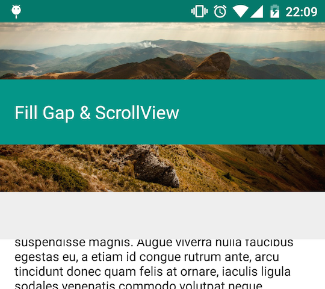
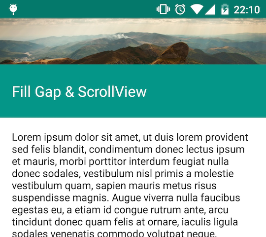

# Filling gap on top of the Toolbar

This topic describes how to fill the gap on top of the Toolbar,
which are implemented in the following examples.

* FillGapBaseActivity
* FillGapListViewActivity
* FillGapRecyclerViewActivity
* FillGapScrollViewActivity
* FillGap2BaseActivity
* FillGap2ListViewActivity
* FillGap2RecyclerViewActivity
* FillGap2ScrollViewActivity
* FillGap3BaseActivity
* FillGap3ListViewActivity
* FillGap3RecyclerViewActivity
* FillGap3ScrollViewActivity

Please note that these patterns only works for Android 4+.

---

## Overview

There are many examples for this pattern, but they can be classified to the following:

* FillGap
    * When swiping up, the header bar expands and fill the gap between the header and the top of the screen.
* FillGap2
    * Almost same as FillGap, but in this pattern,
      after the gap is filled with primary color, the filled space is going to shrink,
      and the header bar moves.
* FillGap3
    * Usually FillGap should work only when the Scrollable view can scroll.
      But sometimes you may want to scroll them with few items, and you can achieve it with this pattern.
    * This uses `TouchInterceptionFrameLayout` (one of the widgets in this library),
      and this component does not handle "velocity" of scrolls,
      so as soon as you touch up your fingers, translation will be stopped.

## Pattern1 (FillGap)

### ScrollView

#### Basic structure

```xml
<FrameLayout android:clipChildren="false">
  <FrameLayout android:id="@+id/image_holder">
    <ImageView android:id="@+id/image"/>
  </FrameLayout>
  <ObservableScrollView android:id="@+id/scroll">
    <TextView android:id="@+id/container"/>
  </ObservableScrollView>
  <FrameLayout android:id="@+id/header" android:clipChildren="false">
    <View android:id="@+id/header_background"/>
    <LinearLayout android:id="@+id/header_bar">
      <TextView android:id="@+id/title"/>
    </LinearLayout>
  </FrameLayout>
</FrameLayout>
```

`clipChildren` attribute is important.
Without it, part of the views are not drawn.

Incorrect (without `android:clipChildren="false"`):



Correct (with `android:clipChildren="false"`):



Coming soon...

## Pattern2 (FillGap2)

Coming soon...

## Pattern3 (FillGap3)

Coming soon...

[Next: Advanced techniques &raquo;](../../docs/advanced/index.md)
