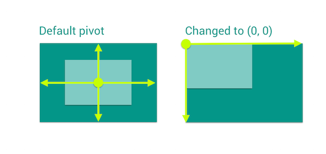
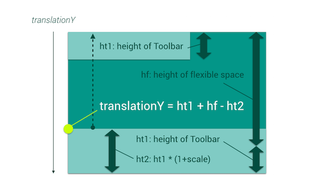

# Flexible space on the Toolbar

This topic describes how to create flexible space on the Toolbar,
which are implemented in the following examples.

* FlexibleSpaceToolbarScrollViewActivity
* FlexibleSpaceToolbarWebViewActivity

I originally tried implementing this pattern (only the title animation):  
[Flexible space with image](http://material-design.storage.googleapis.com/publish/material_v_3/material_ext_publish/0B969e8h0awhvQ3lJdU9WVTh1WWM/patterns_scrolling_flexspaceimage.webm)

---

## Using ScrollView

### Layout with ScrollView

#### Basic structure

```xml
<FrameLayout>
  <ObservableScrollView android:id="@+id/scroll">
    <FrameLayout android:id="@+id/body">
      <TextView/>
    </FrameLayout>
  </ObservableScrollView>
  <View android:id="@+id/flexible_space"/>
  <Toolbar android:id="@+id/toolbar"/>
  <RelativeLayout android:paddingLeft="@dimen/toolbar_margin_start">
    <TextView android:id="@+id/title"/>
    <LinearLayout android:orientation="vertical">
      <View android:layout_height="?attr/actionBarSize"/>
      <View android:layout_height="@dimen/flexible_space_height"/>
    </LinearLayout>
  </RelativeLayout>
</FrameLayout>
```

The root `FrameLayout` is used for moving children separately.

The second `FrameLayout`(`@id/body`) inside the ScrollView is the main content,
and you can put any views as you like.
This time, we'll add just a `TextView`.

`View`(`@id/flexible_space`) is for a "flexible space" which has a opaque background.
This view will be translated vertically on scrolling.

`Toolbar` is a normal Toolbar, but this Toolbar will not have "title".

The next `RelativeLayout` and its children are a little tricky.
The `TextView`(`@id/title`) is the real title view,
and other views (`LinearLayout`, `View`) are padding.
In this "flexible space" pattern, `TextView`'s text should move and its font size should change,
so it needs additional space.
We'll achieve these animations by animate `TextView` itself, so paddings should be outside the `TextView`.

To confirm other attributes,
please see `res/layout/activity_flexiblespacetoolbarscrollview.xml` in the example app.

### Initialization

At first, set the Toolbar as the ActionBar and show "homeAsUp" button.

```java
@Override
protected void onCreate(Bundle savedInstanceState) {
  super.onCreate(savedInstanceState);
  setContentView(R.layout.activity_flexiblespacetoolbarscrollview);

  setSupportActionBar((Toolbar) findViewById(R.id.toolbar));
  getSupportActionBar().setDisplayHomeAsUpEnabled(true);
```

And get the Activity's title and set it to the `TextView` which has the ID `@id/title`.

```java
  mTitleView = (TextView) findViewById(R.id.title);
  mTitleView.setText(getTitle());
  setTitle(null);
```

And initialize other views and fields.

```java
private View mFlexibleSpaceView;
private View mToolbarView;
private TextView mTitleView;
private int mFlexibleSpaceHeight;

@Override
protected void onCreate(Bundle savedInstanceState) {
  // Codes that are already explained above are omitted
  mFlexibleSpaceView = findViewById(R.id.flexible_space);
  mToolbarView = findViewById(R.id.toolbar);

  final ObservableScrollView scrollView = (ObservableScrollView) findViewById(R.id.scroll);
  scrollView.setScrollViewCallbacks(this);

  mFlexibleSpaceHeight = getResources().getDimensionPixelSize(R.dimen.flexible_space_height);
  int flexibleSpaceAndToolbarHeight = mFlexibleSpaceHeight + getActionBarSize();

  findViewById(R.id.body).setPadding(0, flexibleSpaceAndToolbarHeight, 0, 0);
  mFlexibleSpaceView.getLayoutParams().height = flexibleSpaceAndToolbarHeight;
}
```

You should also add `implements ObservableScrollViewCallbacks` to the Activity
and implement those methods as always.

### Animation

We use `onScrollChanged()` to create animation.
We must write following codes:

* Translate the flexible space view
* Translate and scale the title view

#### Translate the flexible space view

This is easy, just translate it using `scrollY`:

```java
@Override
public void onScrollChanged(int scrollY, boolean firstScroll, boolean dragging) {
  ViewHelper.setTranslationY(mFlexibleSpaceView, -scrollY);
}
```

#### Scale the title view

How do you change the size of the font?  
At first I tried just changing the size of the font, but it didn't work. It should be scaled.

The scale should change from `1` to `1.x`. You can change `.x` to fit your app.
In this case, I used the height of the flexible space and the height of the Toolbar. This calculates the maximum `.x`:

```java
float maxScale = (float) (mFlexibleSpaceHeight - mToolbarView.getHeight()) / mToolbarView.getHeight();
```

The scale (we call `.x` part as "scale" from here) should change between 0 to `maxScale`, so it can be written as follows.

```java
// scrollY should be limited.
int adjustedScrollY = (int) ScrollUtils.getFloat(scrollY, 0, mFlexibleSpaceHeight);

// When scrollY is 0, scale equals to maxScale.
// When scrollY reaches to mFlexibleSpaceHeight, scale will be 0.
float scale = maxScale * ((float) mFlexibleSpaceHeight - adjustedScrollY) / mFlexibleSpaceHeight;
```

When scaling the view, we need to set the center point of scaling.
You can handle this by using `pivotX` and `pivotY`, and we should set them to `(0, 0)` like this image:



We will set `pivotX` and `pivotY` first, and then change the scale:

```java
// Pivot the title view to (0, 0)
ViewHelper.setPivotX(mTitleView, 0);
ViewHelper.setPivotY(mTitleView, 0);

// Scale the title view
ViewHelper.setScaleX(mTitleView, 1 + scale);
ViewHelper.setScaleY(mTitleView, 1 + scale);
```

#### Translate the title view

And about `translationY`, this is a little complicated.
Let's see the following picture.



The minimum `translationY` is obviously 0, and we want to know
the maximum `translationY`.
As we can see in the picture, the maximum `translationY` can be calculated with `ht1 + hf - ht2`, so we can write like this:

```java
int maxTitleTranslationY = mToolbarView.getHeight() + mFlexibleSpaceHeight - (int) (mTitleView.getHeight() * (1 + scale));
```

And we should vary this value using `scrollY`.
`scrollY` should be limited and it's already calculated as `adjustedY`:

```java
  int titleTranslationY = (int) (maxTitleTranslationY * ((float) mFlexibleSpaceHeight - adjustedScrollY) / mFlexibleSpaceHeight);
  ViewHelper.setTranslationY(mTitleView, titleTranslationY);
```

Finally, we've finished translation and scaling.

```java
@Override
public void onScrollChanged(int scrollY, boolean firstScroll, boolean dragging) {
  ViewHelper.setTranslationY(mFlexibleSpaceView, -scrollY);

  // Calculate scale
  int adjustedScrollY = (int) ScrollUtils.getFloat(scrollY, 0, mFlexibleSpaceHeight);
  float maxScale = (float) (mFlexibleSpaceHeight - mToolbarView.getHeight()) / mToolbarView.getHeight();
  float scale = maxScale * ((float) mFlexibleSpaceHeight - adjustedScrollY) / mFlexibleSpaceHeight;

  // Pivot the title view to (0, 0)
  ViewHelper.setPivotX(mTitleView, 0);
  ViewHelper.setPivotY(mTitleView, 0);

  // Scale the title view
  ViewHelper.setScaleX(mTitleView, 1 + scale);
  ViewHelper.setScaleY(mTitleView, 1 + scale);

  // Translate the title view
  int maxTitleTranslationY = mToolbarView.getHeight() + mFlexibleSpaceHeight - (int) (mTitleView.getHeight() * (1 + scale));
  int titleTranslationY = (int) (maxTitleTranslationY * ((float) mFlexibleSpaceHeight - adjustedScrollY) / mFlexibleSpaceHeight);
  ViewHelper.setTranslationY(mTitleView, titleTranslationY);
}
```

#### Adjust the initial state of the title

It's almost finished, but maybe you will notice
that when the screen is launched,
the title is located at the top of the screen.
It should be located at the bottom of the header view area and have larger font.

This is because `onScrollChanged()` is not called.  
You can fix that by calling `onScrollChanged()` just after the views are laied out.
And you can handle this "laid out" event by using `ViewTreeObserver#addOnGlobalLayoutListener()`.

```java
@Override
protected void onCreate(Bundle savedInstanceState) {
  // Other initialization codes are omitted
  ViewTreeObserver vto = mTitleView.getViewTreeObserver();
  vto.addOnGlobalLayoutListener(new ViewTreeObserver.OnGlobalLayoutListener() {
    @Override
    public void onGlobalLayout() {
      if (Build.VERSION.SDK_INT < Build.VERSION_CODES.JELLY_BEAN) {
        view.getViewTreeObserver().removeGlobalOnLayoutListener(this);
      } else {
        view.getViewTreeObserver().removeOnGlobalLayoutListener(this);
      }
      updateFlexibleSpaceText(scrollView.getCurrentScrollY());
    }
  });
}

@Override
public void onScrollChanged(int scrollY, boolean firstScroll, boolean dragging) {
  updateFlexibleSpaceText(scrollY);
}

private void updateFlexibleSpaceText(scrollY) {
  // Original animation codes are omitted
}
```

You can replace the following `ViewTreeObserver` codes

```java
ViewTreeObserver vto = mTitleView.getViewTreeObserver();
vto.addOnGlobalLayoutListener(new ViewTreeObserver.OnGlobalLayoutListener() {
  @Override
  public void onGlobalLayout() {
    if (Build.VERSION.SDK_INT < Build.VERSION_CODES.JELLY_BEAN) {
      view.getViewTreeObserver().removeGlobalOnLayoutListener(this);
    } else {
      view.getViewTreeObserver().removeOnGlobalLayoutListener(this);
    }
    updateFlexibleSpaceText(scrollView.getCurrentScrollY());
  }
});
```

to this:

```java
ScrollUtils.addOnGlobalLayoutListener(mTitleView, new Runnable() {
  @Override
  public void run() {
    updateFlexibleSpaceText(scrollView.getCurrentScrollY());
  }
});
```

That's all!

[Next: Flexible space with image &raquo;](../../docs/basic/flexible-space-with-image.md)
