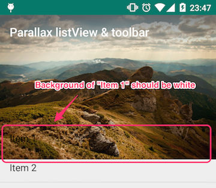

# Parallax image

This topic describes how to create parallax effect,
which are implemented in the following examples.

* ParallaxToolbarScrollViewActivity
* ParallaxToolbarListViewActivity

---

## Overview

In this topic, "parallax" means the following layout and behavior:

* The layout has an image on the top of the layout.
* The image will move with half the speed of that of the ScrollView.
* ScrollView itself has a big padding, which is like a "window" to see the image.

To make the image "parallax", we need to do some tricks on the layout.  

`ObservableScrollView` and `ObservableListView` are a little different
around handling paddings.
I'll explain from `ObservableScrollView`.

---

## ScrollView

### Layout

#### Basic structure

At first, let's see the following basic structure of the layout.

```xml
<FrameLayout>
  <ObservableScrollView>
    <RelativeLayout>
      <ImageView/>
      <View/>
      <TextView/>
    </RelativeLayout>
  </ObservableScrollView>
  <Toolbar/>
</FrameLayout>
```

Please note that in this XML, I intentionally omitted attributes(`android:XXX`)
and package name (`com.github.XXX`) for readability.

##### Why should we use FrameLayout?

As you can see on the example app, Toolbar is overlaid to the ObservableScrollView.
To do this, we need to use `FrameLayout` or `RelativeLayout`.

##### What's inside of the ObservableScrollView?

`ObservableScrollView` extends `ScrollView`, so it can have no more than 1 child.
However we need more children, so placing a `ViewGroup` as the child of `ObservableScrollView` is required.

`ImageView` is the `View` which is going to have "parallax" effect.
You can replace it to other type of `View` if you want.

`TextView` is the main content of the screen, you can also replace it to other type of `View`.

`View` is an "anchor", I'll explain it later.

We need to move the content and the image separately,
so the parent of them &mdash; child of `ObservableScrollView` &mdash;
should be `RelativeLayout` or `FrameLayout`.
This time, we use `RelativeLayout` for that purpose.

#### Don't move the content when its parent is scrolled

How do you place the main content (a `TextView` for this time) under the `ImageView`?

Suppose you define the position with `android:layout_below` attribute:

```xml
<!-- some attributes are omitted -->
<RelativeLayout>
  <ImageView android:id="@+id/image">
  <TextView android:layout_below="@id/image">
</RelativeLayout>
```

We need to move `ImageView` but if we do this, 
the `TextView` moves with the same speed as `ImageView`
because its layout is defined with `android:layout_below="@id/image"`.
So we should define the `TextView`'s position with another "anchor" view:

```xml
<!-- some attributes are omitted -->
<RelativeLayout>
  <ImageView android:id="@+id/image"
             android:layout_height="@dimen/parallax_image_height">
  <View android:id="@+id/anchor"
        android:layout_height="@dimen/parallax_image_height"
        android:minHeight="@dimen/parallax_image_height" />
  <TextView android:layout_below="@id/anchor">
</RelativeLayout>
```

With this anchor view, we can move only `ImageView`.
The anchor `View` and `TextView` will remain in their position.

#### Set the content color explicitly

We need to set the background color of the main content explicitly,
because the image is underlying.

```xml
<TextView android:layout_below="@id/anchor"
  android:background="@android:color/white" />
```

#### Complete the layout

Now set the rest of the attributes of the layout,
such as `android:layout_width`, `android:padding`, etc.  
Please see the folloing codes for details.

* `res/layout/activity_parallaxtoolbarscrollview.java`

### Animation

#### Basic structure of Activity

We use `AppCompatActivity` of the v7 appcompat library for the base `Activity` class,
and implement `ObservableScrollViewCallbacks`.

```java
public class ParallaxToolbarScrollViewActivity
  extends AppCompatActivity implements ObservableScrollViewCallbacks {
```

#### Initialize views

Then initialize the views like this.

```java
// Fields
private View mImageView;
private View mToolbarView;
private ObservableScrollView mScrollView;
private int mParallaxImageHeight;

@Override
protected void onCreate(Bundle savedInstanceState) {
  super.onCreate(savedInstanceState);
  setContentView(R.layout.activity_parallaxtoolbarscrollview);

  setSupportActionBar((Toolbar) findViewById(R.id.toolbar));

  mImageView = findViewById(R.id.image);
  mToolbarView = findViewById(R.id.toolbar);
  mToolbarView.setBackgroundColor(
    ScrollUtils.getColorWithAlpha(0, getResources().getColor(R.color.primary)));

  mScrollView = (ObservableScrollView) findViewById(R.id.scroll);
  mScrollView.setScrollViewCallbacks(this);

  mParallaxImageHeight = getResources().getDimensionPixelSize(
    R.dimen.parallax_image_height);
}
```

The Toolbar should be transparent at the beginning, so set the alpha of the background color to 0
by using the `ScrollUtils` utility class.
This is optional and you can omit this if you don't use the Toolbar.

#### Change the position on scrolling

We use `onScrollChanged()` method, one of `ObservableScrollViewCallbacks`, to animate the view.
What we need to do in this method is:

1. translate the `ImageView` in Y-axis using `scrollY` parameter
1. change the alpha value of the background color of the `Toolbar` using `scrollY` parameter

The second one is optional. You can omit this if you don't use the Toolbar.

##### Translate the ImageView

Just set the `translateY` property to half of `scrollY`.  
If you want to change the "depth" of the parallax effect, adjust this value (`scrollY / 2`).

```java
@Override
public void onScrollChanged(int scrollY, boolean firstScroll, boolean dragging) {
  ViewHelper.setTranslationY(mImageView, scrollY / 2);
}
```

##### Change the alpha of the Toolbar background color

We should change the alpha value of the background color of the Toolbar,
so we can write like this.

```java
@Override
public void onScrollChanged(int scrollY, boolean firstScroll, boolean dragging) {
  int baseColor = getResources().getColor(R.color.primary);
  float alpha = 0; // TODO Fix this value
  mToolbarView.setBackgroundColor(ScrollUtils.getColorWithAlpha(alpha, baseColor));
```

Changing alpha is a little complicated, so I wrote `float alpha = 0` temporarily.  
Let's confirm the conditions of the colors and fix the `alpha` value.

* If the `ObservableScrollView` is not scrolled, Toolbar is transparent.  
  (If `scrollY` equals to 0, alpha of the Toolbar is 0.)
* If the `ObservableScrollView` is scrolled, it becomes opaque gradually,
  and when it's scrolled to a certain point, Toolbar is completely opaque.  
  (If `scrollY` equals to `mParallaxImageHeight`, alpha of the Toolbar is 1.)

We need to express these conditions as a formula.

`alpha` should changes from 0 to 1, but `scrollY` changes from 0 to thousands,
so `scrollY` should be scaled.  
We should divide `scrollY` with `mParallaxImageHeight` because
when `alpha` becomes 1, `scrollY` should be equal to `mParallaxImageHeight`.

```java
float alpha = (float) scrollY / mParallaxImageHeight;
```

Please note that `scrollY` and `mParallaxImageHeight` are both type `int`,
so you need to cast one of them to `float`.

But how is it when `scrollY` becomes more than `mParallaxImageHeight`?  
Let's simulate the result values:

| `scrollY` | `mParallaxImageHeight` | `alpha`   | Valid alpha?  |
| ---------:| ----------------------:| ---------:| ------------- |
| 0         | 300                    | 0         | Valid         |
| 150       | 300                    | 0.5       | Valid         |
| 300       | 300                    | 1.0       | Valid         |
| 450       | 300                    | _**1.5**_ | _**Invalid**_ |

As we can see in the 4th row (`scrollY == 450`),
we need to control `alpha` so that it will not exceed 1.0.
This time we use `Math.min()` to limit the value from 0 to 1.

```java
float alpha = Math.min(1, (float) scrollY / mParallaxImageHeight);
```

Now it's done.  
`onScrollChanged` will be like this:

```java
@Override
public void onScrollChanged(int scrollY, boolean firstScroll, boolean dragging) {
  int baseColor = getResources().getColor(R.color.primary);
  float alpha = Math.min(1, (float) scrollY / mParallaxImageHeight);
  mToolbarView.setBackgroundColor(ScrollUtils.getColorWithAlpha(alpha, baseColor));
  ViewHelper.setTranslationY(mImageView, scrollY / 2);
}
```

#### Restore scroll state

We need to handle one more thing: restoring scroll state when the Activity is restored.  
`ObservableScrollView` itself stores its scroll position,
so you just need to update the view
in the `onRestoreInstanceState()` method.

```java
@Override
protected void onRestoreInstanceState(Bundle savedInstanceState) {
  super.onRestoreInstanceState(savedInstanceState);
  onScrollChanged(mScrollView.getCurrentScrollY(), false, false);
}
```

---

## ListView

Let's see the difference of the implementation between ListView version and ScrollView version.

### Layout

#### Basic structure

```xml
<FrameLayout>
  <ImageView/>
  <View/>
  <ObservableListView/>
  <Toolbar/>
</FrameLayout>
```

We use `FrameLayout` to the root view, just like ScrollView pattern.  
`FrameLayout` can be used to move children views separately.

`ImageView` is the view which should have "parallax" effect.

The next `View` is used for different purpose from that of ScrollView.
I'll explain this later.


#### Why do we use different layout?

Unlike ScrollView, ListView cannot have children views,
so `ImageView` should be outside of the scrollable view (ListView)
and we should move the `ImageView` manually.

#### How do we place ImageView and ListView?

`ImageView` is going to be scrolled slower than ListView
(because we're going to make "parallax" effect), 
so `ImageView` should be underneath the ListView.
Otherwise, the bottom of the `ImageView` overlaps with the top of the ListView.

Also, ListView should have a big padding
at the top of the ListView to make `ImageView` visible.  
We achieve this by adding a transparent header view to the ListView.

#### Why do we need a View?

As I mentioned above, ListView should have a transparent header,
so its background color should be also transparent.
But if we do this, not only the header view but also the items of the ListView
become transparent.




To avoid this, we set a dummy background view under the ListView.

### Animation

#### Basic structure of Activity

It's same as `ParallaxToolbarScrollViewActivity` example.

```java
public class ParallaxToolbarListViewActivity
  extends BaseActivity implements ObservableScrollViewCallbacks {
```

#### Initialize views

Like ScrollView, initialize the `ObservableListView`, `ImageView`, Toolbar, etc.  
And as I explained, ListView should have a header view.

```java
private View mImageView;
private View mToolbarView;
private View mListBackgroundView;
private ObservableListView mListView;
private int mParallaxImageHeight;

@Override
protected void onCreate(Bundle savedInstanceState) {
  super.onCreate(savedInstanceState);
  setContentView(R.layout.activity_parallaxtoolbarlistview) ;

  setSupportActionBar((Toolbar) findViewById(R.id.toolbar));

  mImageView = findViewById(R.id.image);
  mToolbarView = findViewById(R.id.toolbar);
  mToolbarView.setBackgroundColor(ScrollUtils.getColorWithAlpha(0, getResources().getColor(R.color.primary)));

  mParallaxImageHeight = getResources().getDimensionPixelSize(R.dimen.parallax_image_height);

  mListView = (ObservableListView) findViewById(R.id.list);
  mListView.setScrollViewCallbacks(this);
  // Set padding view for ListView. This is the flexible space.
  View paddingView = new View(this);
  AbsListView.LayoutParams lp = new AbsListView.LayoutParams(AbsListView.LayoutParams.MATCH_PARENT,
          mParallaxImageHeight);
  paddingView.setLayoutParams(lp);
  paddingView.setClickable(true);

  mListView.addHeaderView(paddingView);
  setDummyData(mListView);
  mListBackgroundView = findViewById(R.id.list_background);
```

Note that following code is necessary to disable header view's list selector effect.

```java
  paddingView.setClickable(true);
```

`setDummyData()` should be replaced to appropriate data population codes.

#### Change the position on scrolling

##### Translate the ImageView

We use `onScrollChanged` method to translate views.

```java
@Override
public void onScrollChanged(int scrollY, boolean firstScroll, boolean dragging) {
}
```

Basically, we should just set the translateY property to half of `scrollY`.
But be careful, unlike ScrollView, when `scrollY` gets larger then `translateY` of `ImageView` should become smaller
because `ImageView` is not a child of the ListView.
So we should use `-scrollY / 2` as `translationY` (and you can adjust "`/ 2`" if you want).

```java
ViewHelper.setTranslationY(mImageView, -scrollY / 2);
```

##### Translate the background view

The background should move with ListView, but it should have an offset `mParallaxImageHeight`
so we can write like this:

```java
ViewHelper.setTranslationY(mListBackgroundView, mParallaxImageHeight - scrollY);
```

But how is it when `scrollY` becomes more than `mParallaxImageHeight`?  
Let's simulate the result values:

| `mParallaxImageHeight` | `scrollY` | `mParallaxImageHeight - scrollY` | TranslationY of `mListViewBackgroundView` should be |
| ----------------------:| ---------:|---------------------------------:|----------------------------------------------------:|
| 300                    | 0         | 300                              | 300                                                 |
| 300                    | 150       | 150                              | 150                                                 |
| 300                    | 300       | 0                                | 0                                                   |
| 300                    | 450       | -150                             | 0                                                   |

The 4th `mParallaxImageHeight - scrollY` becomes negative and it's invalid.  
So use `Math.max()` to avoid this.

```java
ViewHelper.setTranslationY(mListBackgroundView, Math.max(0, -scrollY + mParallaxImageHeight));
```

That's all.  
The rest of the codes are the same as `ObservableScrollView` example.

[Next: Sticky header &raquo;](../../docs/basic/sticky-header.md)
