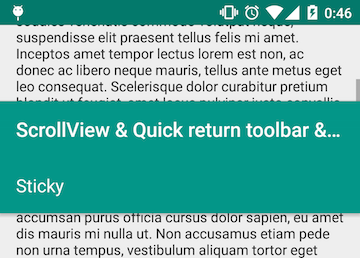
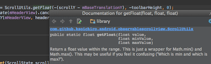

# Sticky header

This topic describes how to keep header on top of the screen,
which are implemented in the following examples.

* StickyHeaderListViewActivity
* StickyHeaderRecyclerViewActivity
* StickyHeaderScrollViewActivity
* StickyHeaderWebViewActivity

---

## Overview

This is a complex version of [Toolbar translation pattern](../../docs/basic/translating-toolbar.md).

We add a features to keep the half of the header view to the top of the screen.
And this time I'll explain using ScrollView.
Replacing it to other type of scrollable views are not so difficult.

## Using ScrollView

### Layout with ScrollView

Let's look at the layout file as always.

Here is the basic structure of StickyHeader pattern with ScrollView.
This is a little difficult than Toolbar's one.

```xml
<FrameLayout>
  <ObservableScrollView android:id="@+id/scroll">
    <LinearLayout android:orientation="vertical">
      <View android:minHeight="?attr/actionBarSize"/>
      <View android:minHeight="?attr/actionBarSize"/>
      <TextView/>
    </LinearLayout>
  </ObservableScrollView>
  <LinearLayout
    android:id="@+id/header"
    android:orientation="vertical">
    <Toolbar
      android:id="@+id/toolbar"
      android:minHeight="?attr/actionBarSize"/>
    <TextView
      android:id="@+id/sticky"
      android:layout_height="?attr/actionBarSize"/>
  </LinearLayout>
</FrameLayout>
```

In Toolbar translation pattern, we used only `ObservableScrollView` and `Toolbar` in `FrameLayout`.
This time, we need to make each views more complex.

#### Create header space for ScrollView with twice the size of ActionBar

At the initial state of views, ScrollView needs to have a header view with twice the size of the ActionBar.
The half of this header view will be "sticky".  
So we simply add 2 `View`s with the height `?attr/actionBarSize` above the `TextView`.

You can also add just 1 `View` with a certain size with `dp`,
but it's better to use `?attr/actionBarSize` because it has multiple values for several size of screens,
screen rotation and OS versions, and using the standard size is good for users.

Another way to achieve this, is to set the height of the `View` programmatically.
You can resolve the value of `?attr/actionBarSize` in `Activity#onCreate()`, multiply it by 2 and set it to the `View`.

And please note that `TextView` is the real content of the ScrollView, so you can replace it to other view if you want.

#### Create sticky part for Toolbar

Toolbar is replaced to `LinearLayout`, and it contains a Toolbar and a `TextView`.
`TextView` will be the "sticky" view.
You can replace it to some complex views.

### Animate the views with ScrollView callbacks

This time, we use two callbacks: `onScrollChanged()` and `onUpOrCancelMotionEvent()` to animate views.
We are going to implement the following animation.

1. Move the Toolbar and the sticky view (we call "header views") when the ScrollView is scrolled.
1. When we scroll the ScrollView, the Toolbar will go out of the screen.
   But when we scroll it more, sticky view must keep its position to the top of the screen.
1. When the Toolbar is not completely hidden and we stop scrolling (touch up the ScrollView),
    * the Toolbar will be shown completely, if we were swiping down.
    * the Toolbar will be hidden completely, if we were swiping up.
1. When we swipe down the ScrollView and touch up, the header view should
   come out immediately. Sometimes it's called "Quick Return" pattern.

#### Move the header view when ScrollView is scrolled

Override the `onScrollChanged()`, and implement some codes with the condition `if (dragging)`.

```java
@Override
public void onScrollChanged(int scrollY, boolean firstScroll, boolean dragging) {
  if (dragging) {
    // TODO implement the rest of the codes
  //} else { // ScrollView is scrolled by inertia
  }
}
```

This is because we want to move views only when it is dragged.
Without this, we cannot achieve the 3rd condition above: showing or hiding the Toolbar automatically
when the scroll ended.

Next step, implement the header view translation.  
At first, create a field with name `mHeaderView`, and initialize it in `onCreate()`:

```java
mHeaderView = findViewById(R.id.header);
```

When the scrollY parameter gets increased, the translationY of `mHeaderView` should decrease.
So we can write like this:

```java
@Override
public void onScrollChanged(int scrollY, boolean firstScroll, boolean dragging) {
  if (dragging) {
    ViewHelper.setTranslationY(mHeaderView, -scrollY);
  }
}
```

#### Sticky view must keep its position to the top of the screen

The header view will disappear completely, and this is not what we want.
`mHeaderView` should stop after moving the height of Toolbar.

```java
@Override
public void onScrollChanged(int scrollY, boolean firstScroll, boolean dragging) {
  if (dragging) {
    int toolbarHeight = mToolbarView.getHeight();
    ViewHelper.setTranslationY(mHeaderView, Math.max(-toolbarHeight, -scrollY));
  }
}
```

You can see the sticky view keeping its position to the top of the screen.

#### When Toolbar is not completely hidden, show or hide it completely

To do this, we should implement `onUpOrCancelMotionEvent`.  
If we swipe down, Toolbar should be shown,
and if we swipe up, Toolbar should be hidden.

```java
@Override
public void onUpOrCancelMotionEvent(ScrollState scrollState) {
  if (scrollState == ScrollState.DOWN) {
    showToolbar();
  } else if (scrollState == ScrollState.UP) {
    hideToolbar();
  }
}
```

But when we swipe up and scrolled less than Toolbar's height,
hiding the Toolbar makes white space around the top of the ScrollView.  
So we should show the Toolbar if `scrollY` is less than Toolbar's height.

```java
@Override
public void onUpOrCancelMotionEvent(ScrollState scrollState) {
  if (scrollState == ScrollState.DOWN) {
    showToolbar();
  } else if (scrollState == ScrollState.UP) {
    int toolbarHeight = mToolbarView.getHeight();
    int scrollY = mScrollView.getCurrentScrollY();
    if (toolbarHeight <= scrollY) {
      hideToolbar();
    } else {
      showToolbar();
    }
  }
}
```

And sometimes `scrollState` becomes `STOP` (or `null`).
If it becomes such values, the header view stops halfway.
To avoid this behavior, write `else` clause.

```java
@Override
public void onUpOrCancelMotionEvent(ScrollState scrollState) {
  if (scrollState == ScrollState.DOWN) {
    showToolbar();
  } else if (scrollState == ScrollState.UP) {
    int toolbarHeight = mToolbarView.getHeight();
    int scrollY = mScrollView.getCurrentScrollY();
    if (toolbarHeight <= scrollY) {
      hideToolbar();
    } else {
      showToolbar();
    }
  } else {
    // Even if onScrollChanged occurs without scrollY changing, toolbar should be adjusted
    if (!toolbarIsShown() && !toolbarIsHidden()) {
      // Toolbar is moving but doesn't know which to move:
      // you can change this to hideToolbar()
      showToolbar();
    }
  }
}
```

Then write the unimplemented methods.  
Unlike Toolbar translation pattern, we use `ViewPropertyAnimator.animate()`
because it's simple and we don't have to change the height of views.

```java
private boolean toolbarIsShown() {
  return ViewHelper.getTranslationY(mHeaderView) == 0;
}

private boolean toolbarIsHidden() {
  return ViewHelper.getTranslationY(mHeaderView) == -mToolbarView.getHeight();
}

private void showToolbar() {
  float headerTranslationY = ViewHelper.getTranslationY(mHeaderView);
  if (headerTranslationY != 0) {
    ViewPropertyAnimator.animate(mHeaderView).cancel();
    ViewPropertyAnimator.animate(mHeaderView).translationY(0).setDuration(200).start();
  }
}

private void hideToolbar() {
  float headerTranslationY = ViewHelper.getTranslationY(mHeaderView);
  int toolbarHeight = mToolbarView.getHeight();
  if (headerTranslationY != -toolbarHeight) {
    ViewPropertyAnimator.animate(mHeaderView).cancel();
    ViewPropertyAnimator.animate(mHeaderView).translationY(-toolbarHeight).setDuration(200).start();
  }
}
```

Once `ViewPropertyAnimator.animate()` is called, animation will be running in the next 200ms.
And if the next animation(`showToolbar()` or `hideToolbar()`) is requested while the animation is running,
the current animation should be canceled.
Therefore we call `ViewPropertyAnimator.animate(mHeaderView).cancel()`
before calling `start()`.

#### When swiping up, header view should scroll

It's almost completed, and if you think it's OK, you don't have to write the following codes.

When we scroll so much and swip down little, the header view will be shown.
And after that, when we drag ScrollView to upper side,
I think that the header view should move with ScrollView, but it doesn't.

So we make the header view to scroll even when `scrollY` is larger than the Toolbar's height.

To do this, we just calculate the distance from the first touch point and the current point.
And the distance from the first touch point become larger than Toolbar's height,
the header view should not scroll any longer.

```java
// Add a field to keep the first scrollY
private int mBaseTranslationY;

@Override
public void onScrollChanged(int scrollY, boolean firstScroll, boolean dragging) {
  if (dragging) {
    int toolbarHeight = mToolbarView.getHeight();
    if (firstScroll) { // Add this if clause
      float currentHeaderTranslationY = ViewHelper.getTranslationY(mHeaderView);
      if (-toolbarHeight < currentHeaderTranslationY) {
        mBaseTranslationY = scrollY;
      }
    }
    // Change -scrollY to -(scrollY - mBaseTranslationY)
    float headerTranslationY = Math.max(-toolbarHeight, -(scrollY - mBaseTranslationY));
    ViewPropertyAnimator.animate(mHeaderView).cancel();
    ViewHelper.setTranslationY(mHeaderView, headerTranslationY);
  }
}

@Override
public void onUpOrCancelMotionEvent(ScrollState scrollState) {
    // Should be cleared when scroll ends
    mBaseTranslationY = 0;
```

It's almost done, but sometimes we can see a weird behavior:
the header view leaves the top of the screen.



This is because `headerTranslationY` can become larger than 0,
so it should be limited by using `Math.min()`.

```java
float headerTranslationY = Math.min(0, Math.max(-toolbarHeight, -(scrollY - mBaseTranslationY));
```

Now it's working, but don't you think it's a little complicated expression?  
Android-ObservableScrollView provides a small utility class `ScrollUtils`,
and we can replace `Math.min(max, Math.max(min, value))` to `ScrollUtils.getFloat()`.

```java
float headerTranslationY = ScrollUtils.getFloat(-(scrollY - mBaseTranslationY), -toolbarHeight, 0);
```

Of course, you can confirm the meaning of each parameters easily.
Pressing `F1` key on `getFloat()` will show the javadoc window:



[Next: Flexible space on the Toolbar &raquo;](../../docs/basic/flexible-space-toolbar.md)
