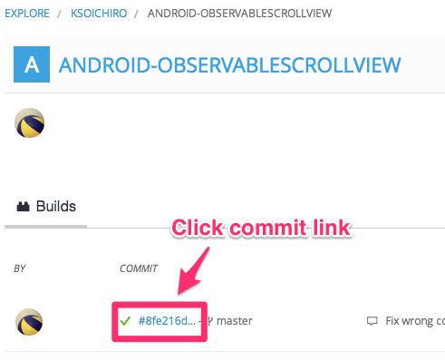
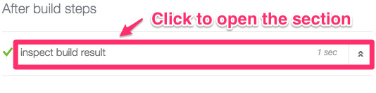
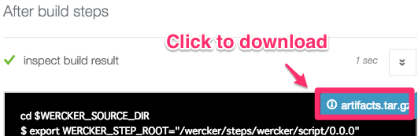

# Download from wercker

[wercker](http://wercker.com/) is a CI service and this project uses wercker to provide the latest sample apk.
If you're not interested in this, go to the next topic.

## Login to wercker

At first, you need to be a member of [wercker](http://wercker.com/) and should login before download the app.

## Visit this repository

Click the badge below to show this repository's builds.

## Select the build

Then select the commit link that you want to download.  
Note that green check mark in front of the link means successful builds and red ones are failure,  
and you can only download the app from the green ones.

## Open the last section

Scroll the screen, and click anywhere in the "inspect build result" section to open it.

## Download the artifact

Finally, you can download the apk file by clicking the `artifact.tar.gz` link.

[Next: Build on Android Studio &raquo;](../../docs/example/android-studio.md)
